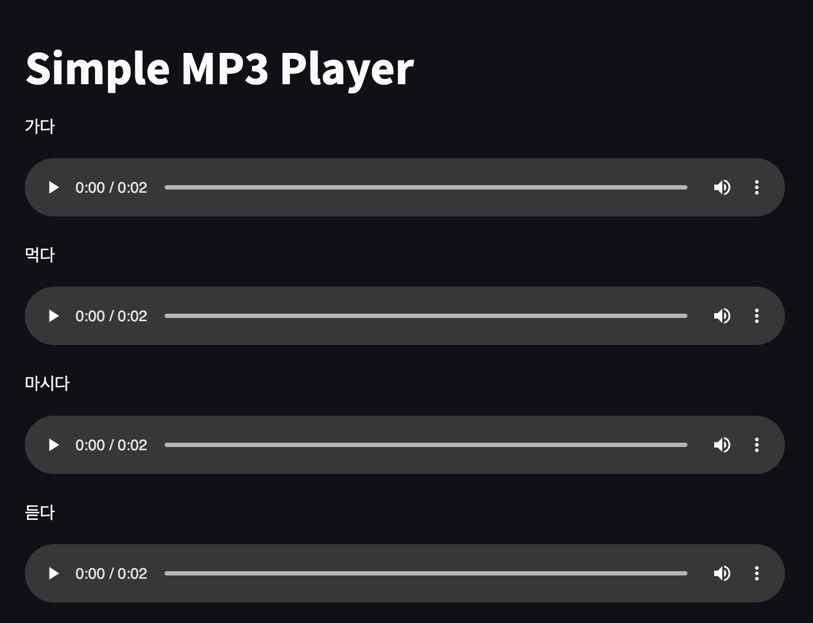

## korean_verb_tool

This is a simple application designed to help users play and listen to various forms of Korean verbs.

### Features
**Korean Verb Variants**: Hear different conjugations and forms of Korean verbs.

